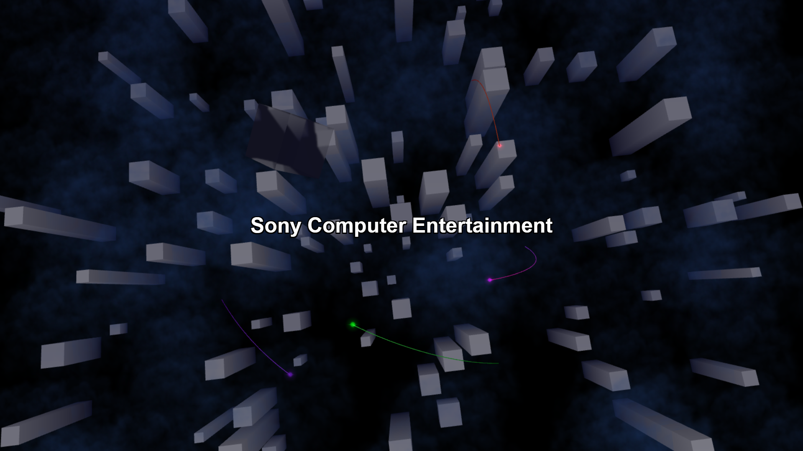

# PS2 Startup Style Wallpapers

This project is a website built with Three.js that emulates the PlayStation 2 (PS2) startup animation. It is designed to be used as a dynamic wallpaper.

## Live Demo

You can view a live demo here: https://whitesun13.github.io/PS2-Live-Wallpaper/

## Features

*   Animated visuals inspired by the PS2 startup sequence.
*   Built using Three.js for 3D rendering.

## Usage with Lively Wallpaper

This wallpaper can be used with Lively Wallpaper (available on Windows).

1.  Open Lively Wallpaper.
2.  Click on the "+" (Add Wallpaper) button.
3.  In the "Enter URL" field, paste the link to the live demo: https://whitesun13.github.io/PS2-Live-Wallpaper/
4.  Click the arrow button (or "OK") to add.
5.  Select the newly added wallpaper from your Lively library.
